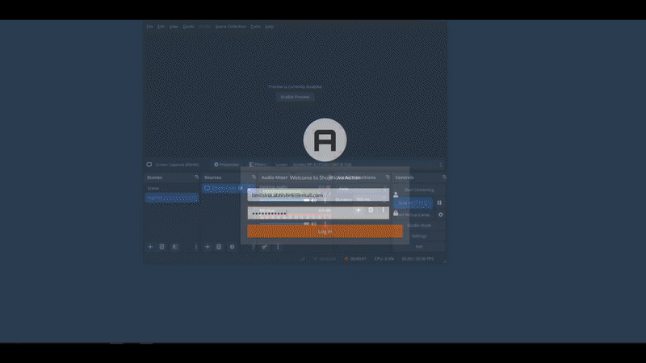

[](https://app.codacy.com/gh/abhishek-T99/ecommerce_backend/dashboard?utm_source=gh&utm_medium=referral&utm_content=&utm_campaign=Badge_grade)

# ShopNova API

A robust and scalable E-Commerce application backend API built with Django and Django REST Framework. This project provides a feature-rich E-Commerce platform with support for user authentication, product management, cart and checkout functionality, payment integration, reviews and rating functionality and more.

---

### Admin Panel


### APIs List


---

## Site URL: 

```bash
https://shopnova.up.railway.app
```

---

## Features

- Swagger API documentation
- REST framework implemented
- Authentication and authorization using SimpleJWT
- Customized Admin Panel using Jazzmin
- User profile creation and update
- Cart/Wishlist features
- Checkout features
- Password change and reset via email
- API versioning
- Email system integrated
- Notification system integrated
- PayPal payment integration
- Stripe payment integration
- Multi-role support: Customer and Vendor
- Discount coupon functionality
- Product search feature
- Product review and rating system
- Product receipt via email
- Sales statistics for vendors

---

## Tech Stack

- **Backend**: Django, Django REST Framework
- **Database**: PostgreSQL (production), SQLite (development)
- **Storage**: AWS S3 (or Storj) for media and static files
- **Hosting**: Railway (for deployment)
- **API Documentation**: Swagger
- **Authentication**: SimpleJWT
- **Payment Gateways**: PayPal, Stripe
- **Email Services**: Brevo (or Mailgun)

---

## Prerequisites

Before setting up the project, ensure you have the following installed:

- Python 3.11 or higher
- pip (Python package manager)
- PostgreSQL (or SQLite for development)
- Virtualenv or Conda (optional but recommended)

---

## Environment Variables

To run this project, you need to set up the following environment variables. Create a `.env` file in the root directory and add the following:

### Project Settings

`SECRET_KEY=<add your key>`

`ALLOWED_HOSTS=<add your allowed hosts>`

`DEBUG=<True/False>`

`CSRF_TRUSTED_ORIGINS=<add your trusted origins>`

### Database

`DATABASE_URL=<add your database URL>`

### Site URL

`SITE_URL=<add your frontend site URL>`

### Stripe Payment

`STRIPE_PUBLIC_KEY=<add your stripe public key>`

`STRIPE_SECRET_KEY=<add your stripe secret key>`

### PayPal Payment

`PAYPAL_CLIENT_ID=<add your paypal client id>`

`PAYPAL_SECRET_ID=<add your paypal secret id>`

### Email Services

`BREVO_API_KEY=<add your mailgun your API key>`

`BREVO_EMAIL=<add your brevo sender email id>`

### AWS S3 Storage

`USE_AWS=<True/False>`

`AWS_ACCESS_KEY_ID=<add your AWS access key id>`

`AWS_SECRET_ACCESS_KEY=<add your AWS secret access key>`

`AWS_STORAGE_BUCKET_NAME=<add your AWS bucket name>`

---

## Setup Guide

### Step 1: Clone the Repository

```bash
git clone https://github.com/abhishek-T99/ecommerce_backend.git
cd ecommerce_backend
```

### Step 2: Set Up Virtual Environment

1. Create a virtual environment:
    ```bash
    python -m venv venv
    ```

2. Activate the virtual environment:
   - On **Windows**:
     ```bash
     .\venv\Scripts\activate
     ```
   - On **macOS/Linux**:
     ```bash
     source venv/bin/activate
     ```

### Step 3: Install Dependencies

Install the required dependencies by running:
- For **Development**:
  ```bash
  pip install -r requirements/dev.txt
  ```
- For **Production**:
  ```bash
  pip install -r requirements/prod.txt
  ```

### Step 4: Set Up environment variables

Create a `.env` file in the project root and add the environment variables listed in the Environment Variables section above

### Step 5: Make migration files

Run the following command to create migration files:

```bash
python manage.py makemigrations
```

### Step 6: Run Migrations

Run the following command to apply database migrations:

```bash
python manage.py migrate
```

### Step 7: Create a Superuser

To access the Django admin panel, you need to create a superuser. Run the following command:

```bash
python manage.py createsuperuser
```

### Step 8: Run the Development Server

Start the Django development server by running the following command:

```bash
python manage.py runserver 8000
```

### Step 9: Access API Documentation
```bash
http://127.0.0.1:8000
```

---

## Contributing

I welcome contributions from the community! If you'd like to contribute to this project, please follow these steps:

1. **Fork the Repository**: Click the "Fork" button at the top right of this repository to create your own copy.

2. **Clone the Forked Repository**:
   
   ```bash
   git clone https://github.com/your-username/ecommerce_backend.git
   cd ecommerce_backend
   ```

3. **Create a New Branch**:

   ```bash
   git checkout -b feature/YourFeatureName
   ```

4. **Make Your Changes**: Implement your feature or fix bugs. Ensure your code follows the project's coding standards.

5. **Commit Your Changes**:

   ```bash
   git add .
   git commit -m "feat: Your feature or fix description"
   ```

6. **Push to Your Branch**:

   ```bash
   git push origin feature/YourFeatureName
   ```

7. **Open a Pull Request**:

   - Go to the original repository on GitHub.
   - Click on the **"Pull Requests"** tab.
   - Click the **"New Pull Request"** button.
   - Select your forked repository and the branch you created (`feature/YourFeatureName`).
   - Add a detailed description of your changes
   - Submit the pull request.

---

## TODO:

- [ ] Add unit tests for all API endpoints.
- [ ] Implement a recommendation system for products.
- [ ] Implement a refund system for canceled orders.
- [ ] Improve the search functionality with Elastic Search
- [ ] Add support for social login (Google, Facebook, etc.).

---
